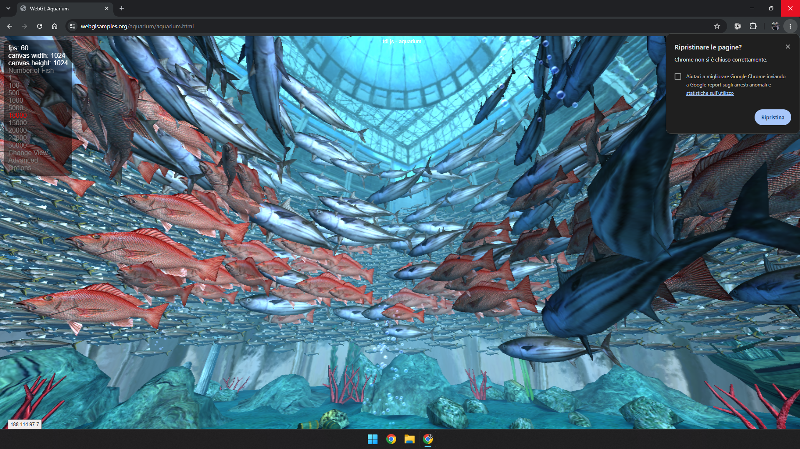

# Experimental Xe SR-IOV patches for Meteor Lake / Arrow Lake

Independent research into the missing Xe PF services used by Intel Windows SR-IOV guests on MTL/ARL. **The 2026-10-09 ARL test corrects the reproduced Windows UI text corruption through a PF render-cache register permission. The project remains experimental.**

[Render-cache fix and measured results](docs/RCC_FIX.md): 24/24 A8/BGRA copy cases and 8/8 real Settings captures correct, without inserting a corrective flush into Windows commands.

Read the [disclaimer](DISCLAIMER.md), [known issues and tests](docs/TESTING.md), and [development provenance](docs/PROVENANCE.md) before using the patch.

## Exact kernel base

| Item | Version |
| --- | --- |
| Source repository | [intel/mainline-tracking](https://github.com/intel/mainline-tracking) |
| Kernel version | **7.2.7** |
| Base commit | [`c4227406af3b9ad8f8072b222ca06e0039f64441`](https://github.com/intel/mainline-tracking/commit/c4227406af3b9ad8f8072b222ca06e0039f64441) |
| Source tag | `mainline-preprod-v7.2.7-linux-260925T043548Z` |
| Tested local kernel release | `7.2.7-adv-xe-runtime5+`, with the separately signed RCC Xe module |
| Patch | [linux-7.2.7-xe-mtl-arl-sriov-experimental.patch](patches/linux-7.2.7-xe-mtl-arl-sriov-experimental.patch) |

The full patch is extracted from the source used to build the boot-tested Xe module. It changes 33 Xe files (1,622 insertions, 23 deletions). Application to the exact base reproduces all 552 reviewed Xe source hashes. Applicability to other commits, vanilla Linux, or Ubuntu distribution kernels has not been established.

## What the patch implements

- Enables the SR-IOV capability flag on the MTL descriptor shared with ARL.
- Adds the VF-to-PF GuC MMIO relay service, including handshake, runtime query, and GGTT update handling.
- Implements CTB `UPDATE_GGTT32` (`0x0102`) for the experimental Media 13 path.
- Uses Xe provisioning, workqueues, GPU scheduling, fences, and GGTT invalidation to complete VF updates.
- Performs Media 13 GGTT writes through privileged `MI_UPDATE_GTT` GPU batches, with VF region/owner validation.
- Adds work lifetime and generation checks around provisioning, FLR and CT reset. Concurrent reset behavior still needs hardware validation.
- Allows the Windows VF UMD to access `COMMON_SLICE_CHICKEN3` (`0x7304`) on the render engine of MTL/ARL SR-IOV PFs. Windows can then request BTP+BTI render color cache keying through bit 13.
- Includes the legacy VF runtime register responses and PF trace/debugfs diagnostics used during the investigation.

This is the exact cumulative research snapshot used for the successful test. It retains opt-in full-context-restore and GPU GGTT-owner-assignment diagnostics, plus the earlier MTL/ARL Blend Fill tuning experiment. The new functional delta in the successful before/after test is the `0x7304` permission. Those earlier experiments have not independently been established as rendering fixes. Verbose diagnostics remain present; this is not an upstream submission in its current form.

The [standalone RCC permission patch](patches/linux-7.2.7-xe-mtl-arl-rcc-permission.patch) makes the functional fix easy to inspect or apply to the original October 5 snapshot. It modifies only `xe_reg_whitelist.c` and is already included in the full patch. Its application and resulting whitelist were checked separately; the full cumulative snapshot is the one boot-tested on October 9. Do not apply the standalone patch after the updated full patch.

## Applying the patch

Download or clone this repository, then obtain the exact Intel base in a separate kernel checkout:

```sh
git init linux-xe-experiment
cd linux-xe-experiment
git remote add intel https://github.com/intel/mainline-tracking.git
git fetch --depth=1 intel c4227406af3b9ad8f8072b222ca06e0039f64441
git switch --detach FETCH_HEAD

# Replace /path/to with the location of this patch repository.
git apply --check /path/to/xe-sriov-mtl-arl/patches/linux-7.2.7-xe-mtl-arl-sriov-experimental.patch
git apply /path/to/xe-sriov-mtl-arl/patches/linux-7.2.7-xe-mtl-arl-sriov-experimental.patch
```

Verify both patch checksums using `sha256sum -c SHA256SUMS` from this repository. The [source manifest](verification/patched-source-SHA256SUMS) identifies the 33 changed files produced by the full patch. After applying, it can be checked from the kernel root with:

```sh
sha256sum -c /path/to/xe-sriov-mtl-arl/verification/patched-source-SHA256SUMS
```

Use a known working kernel configuration with Xe, PCI SR-IOV and Intel IOMMU support. Build and install through your normal kernel packaging procedure. Secure Boot systems need their own trusted kernel/module signing process.

## Tested boot environment

The host test used Arrow Lake-P `8086:7d51`, GuC **70.53.0** on both GTs, and these relevant parameters:

```text
intel_iommu=on iommu=pt xe.force_probe=7d51 i915.force_probe=!7d51 module_blacklist=i915 xe.max_vfs=3 xe.mtl_sriov_full_restore=1 xe.mtl_sriov_gpu_assign=1
```

The two `mtl_sriov_*` options default to false and were enabled in the cumulative test build. Their individual earlier trials did not resolve the UI defect. They are documented here to reproduce the environment in which the RCC permission was verified.

`xe.max_vfs=3` sets the maximum; VFs must also be created through the PF's `sriov_numvfs` or your existing management service. The tested PF was `0000:00:02.0`; one of three created VFs was passed to Windows. Device IDs and PCI addresses depend on the machine.

Keep a known working kernel available and use an explicitly selected test boot. The tested fallback was an i915 6.17 kernel. [Test results and unresolved problems](docs/TESTING.md).

## Recommended Windows VM configuration

To help avoid Intel graphics **Code 43** in Windows guests, use the following `<features>` section in the libvirt domain XML:

```xml
<features>
  <acpi/>
  <apic/>
  <hyperv mode="passthrough">
  </hyperv>
  <vmport state="off"/>
  <smm state="on"/>
</features>
```

Merge this into the VM's existing `<features>` section rather than adding a second section.

## Guest screenshot

Windows guest running the WebGL Aquarium demo, captured from Looking Glass shared memory at **1920×1080** on 2026-10-05:



The displayed FPS counter is not a validated benchmark. This image records the earlier October 5 build, which still had text corruption. The October 9 fix and remaining test limits are recorded in [test status](docs/TESTING.md) and the [RCC report](docs/RCC_FIX.md).

## AI-assisted development

The implementation was developed with **OpenAI Codex / LLM assistance**, through analysis of older i915 SR-IOV code, the official Intel i915 DKMS patch series, Xe paths for other enabled platforms, and public Intel technical manuals. The Xe integration follows its existing scheduling and resource model. [Methods, sources and attribution](docs/PROVENANCE.md).

## License

The touched Xe files and new ABI headers use **MIT SPDX identifiers**. Project additions are provided under the [MIT license](LICENSE); existing upstream notices remain applicable. The complete Linux kernel is governed by its own `COPYING` and per-file licenses. Public Intel manuals are referenced by links, with their own rights and terms.
